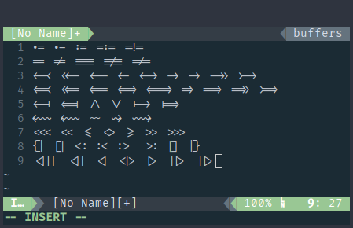

# Ligature support patches for ST

Patches to ST (suckless terminal) that add support for drawing ligatures.

The code uses Harfbuzz library to transform original text of a single line to a list of glyphs with ligatures included.

Due to some limitations in drawing engine, ligatures will break when crossing colors, font styles or selection. They will still render properly as separate symbols, just not as ligatures.

# Example

Taken with Fira Code Regular 14pt:



# Dependencies

* Harfbuzz library & headers. Install it with your favorite package manager.

# Usage

Run from ST source code directory:
```
$ patch -i <patch file>
```
Then compile as usual.

Original patch was made for clean version of ST from latest master commit. It is not 100% compatible with Scrollback and Alpha patches, so I made a modified version that you can apply on top of a Scrollback and/or Alpha patch.

Also there's a special version compatible with Boxdraw patch.

I can't maintain compatibility with all possible patch combinations, so you'll have to figure out diff conflicts yourself if you apply anything on top of what has been checked and added to this repo.

# Acknowledgements

Harfbuzz repository and documentation.
